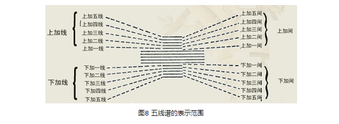

## 乐理基础

### 基础知识与定义

音 ： 称一段声波为一个音

纯音： 一个特定频率的简谐振动产生的声波为纯音

复合音： 多个纯音组合得到纯音

音乐： 大量复合音组合得到音乐

纯音组合成复合音的方式多种多样，最常见的两种是：谐波叠加，拍音叠加

音高：频率

#### 谐波叠加

将一个特定频率f的正弦波称为基波，频率为其整数倍的正弦波称为谐波，音乐上也称之为泛音。

如：称f为基波，则可称2f为二次谐波，诸如此类

基波与谐波叠加，得到的复合音的方式称为谐波叠加，明显谐波叠加得到的波的频率等于基波频率

单个乐器演奏单个音，得到的就是一种谐波叠加音，称之单音，单音的频率f称为高音，一般而言，传统乐器得到的声音都是复合音，这种复合音的基波一般振幅最大，谐波振幅较小

不同的乐器即使演奏同样的音高，听起来也不一样，称之音色不同，这是因为谐波叠加的时候，振幅的比值不同

#### 拍音叠加

拍音叠加在谐波叠加的基础上产生，谐波叠加得到一个单音，不同频率的单音叠加，同时如果各单音的振幅接近，称之拍音

因而，拍音叠加的情况是相当复杂的，甚至不一定会得到一个音（不存在周期性），但是有一些特殊情况，例如：

1. 如果两个单音的频率均为整数，则叠加得到的拍音的周期等于二者周期的最小公倍数
2. 如果两个频率相差一倍的单音进行叠加，就会得到频率等于低音频率的拍音，这样的拍音听起来很像是单音

纯八度：两个频率相差一倍的单音（也即频率比为1：2）之间的音程称为纯八度

音程：两个音之间的频率差称为音程

### 相对高音与十二平均律

如果将一个纯八度按照一定的规律分为12份，每一份称为1个半音，两份称为1个全音，这种称之为十二平均律

十二平均律划分十二份的规律为指数曲线，相邻单音之间为等比例的，比值为 $\sqrt[12]{2}$ 

这条曲线应该是
$$
f_x = f_0 \times 2^{\frac{x}{12}}
$$

因此十二平均律在一个纯八度中分出了13个单音，规定相邻两个音之间的音数为0.5（虽然一个频率就是一个音，原则上应该是无穷）

毫无疑问，给定音程和较低的音频率，我们就可以计算较高音的频率。对于十二平均律来说十三个单音之间的音程只有12种，他们对应的之间的音数为从0.5到6，规定这十二种音程的名字：

### 绝对高音与五线谱

五线谱中的五根线自下至上依次称为第一线到第五线，其中的四个间依次称为第一间到第四间。不同的线和间代表不同的音高。

如果音太高或者太低，可以在五线谱的上下加线，下面的从上往下，可以成为下加一线到下加五线，对应会有五个间，分别称为下加一间到下加五间。上面同理，这里再摘一张原博客内的图：

### 钢琴键盘

钢琴有52个白键, 36个黑键, 共88键.

白键和黑键的排列为每七个白键为一组, 其中左侧的三个键两两之间有一个黑键,共两个,右侧四个白键两两之前一共3个黑键,所以一组一共七个白键,五个黑键,一共12个键.

整个键盘最左侧有两个白键加一个黑键, 最右侧一个单独的白键. 中间有7个完整的组. 所以一共是3+7*12+1=88个键.

每一组的七个白键自左至右都叫做CDEFGAB, 这七个组再加上左右的两个不完整的组,一共九个组.

这九个组分别叫做

~~~
大字二组, 大字一组, 大字组, 小字组, 小字一组, 小字二组, 小字三组, 小字四组, 小字五组.
~~~

所以大字二组和小字五组是不完整的组.

大字组是低音区, 小字组到小字二组是中音区, 小字三组到小字五组是高音区. 所以每个区3个组, 但是低音和高音区都比中音区键少.

<b> I am back again </b>

我要重新拾起半途而废的乐理基础知识，这应该是我变得更好的其中一部分。

下面的部分，我会首先尝试一下python版本的音的生成和可视化。前者应该是依赖pyaudio，后者应该会依赖matplotlib。

很有趣的感觉，如果我们可以控制音频设备产生各种频率的声音，那么通过谐波叠加之类的方式，就可以控制产生不同的音色，例如模仿钢琴。这里也可以通过FFT来实现对于钢琴的频谱分析，进而分析出频率成分。

然后似乎简单地通过产生不同频率的声音，时长，那么根据简谱就可以控制生成不同的音乐，最简单的，使用winsound的Beep，就可以控制蜂鸣器产生不同频率的声音，以及时长。

在当今的主流采集卡上，采样频率一般共分为11025Hz、22050Hz、24000Hz、44100Hz、48000Hz五个等级，11025Hz能达到AM调幅广播的声音品质，而22050Hz和24000HZ能达到FM调频广播的声音品质，44100Hz则是理论上的CD音质界限，48000Hz则更加精确一些。 

[音与频率对应表]( https://pages.mtu.edu/~suits/notefreqs.html )

### Pyaudio

pyaudio模块可以负责生成播放音频数据。

[这里]( http://people.csail.mit.edu/hubert/pyaudio/docs/#pasampleformat )是它的文档页面

按照文档说法，使用之前，我们首先需要生成一个PyAudio的实例，这个实例负责初始化音频系统，`pyaudio.PyAudio()`

无论是要记录还是播放音频，都需要获取一个音频stream，然后如果要播放音频可以向stream写入音频数据，也可以从stream中读取数据。

如何获取一个stream呢？使用`pyaudio.PyAudio.open()`方法

这个方法接收如下参数：

~~~python
__init__(PA_manager, rate, channels, format, input=False, output=False, input_device_index=None, output_device_index=None, frames_per_buffer=1024, start=True, input_host_api_specific_stream_info=None, output_host_api_specific_stream_info=None, stream_callback=None)
~~~

明显第一个参数相当于`self`是不用管的，其他参数：

~~~
rate: 采样率
channels:  channels数量
format: 采样格式，一会细说
input:  这是否是一个输入stream，默认False
output: 这是否是一个输出stream，默认False
~~~

一般而言指定一些这些参量就足够了。其余参量的意义可以去看文档

这里的format的要求是Portaudio Sample Formats常量，其中的常量的值包含了以下几种：

~~~python
paFloat32, paInt32, paInt24, paInt16, paInt8, paUInt8, paCustomFormat
~~~

自然这些常量就是一些int常数

所以format究竟如何指定呢？有这么一个函数`pyaudio.get_format_from_width(width, unsigned=True)`

这里面的width的期望值是`1,2,3,4`，分别代表了不同的字节数，如果使用`unsigned`的话，会得到如下结果：

~~~
1:   32  --->  paUInt8
2:   8   --->  paInt16
3:   4   --->  paInt24
4:   1   --->  paFloat32
~~~

如果使用`signed`的话，只有1不同，结果会变成`paInt8`

总之，这意味着什么呢？我认为这个参量对应的应该是音频数据数字化的级数，也就是数值精度，采样率决定了x轴的精度，format自然就决定了y轴精度

至于channels对应的是频道数量吗？左右声道之类的？这个不太懂

欧科，总之就是写入音频数据就欧科了，虽然音频数据的格式我还没懂

